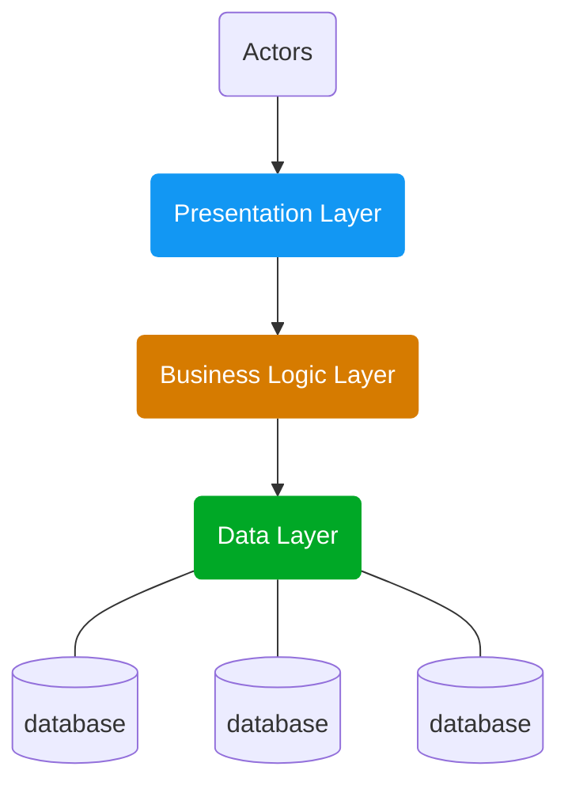

# **Haxagonal Template** 

เป็นตัวอย่างของ Structure Project Go Lang Application ที่ใช้ในการเขียน Api ตัว Golang โดยที่ ใช้การ Design แบบ Hexagonal Architecture (Port & Adapter)

## Table of contents

- [Introduction](#introduction)
  - [Data Layer](#data-layer)
  - [Business logic Layer](#business-logic-layer)
  - [Presentation Layer](#presentation-layer)
- [Hexagonal](#hexagonal)
  - [Hexagonal architecture](#hexagonal-architecture-หรือ-ports-and-adapters-architecture)
  - [Origin](#origin)
  - [Port](#port)
  - [Adapter](#adapter)
- [Persistance Environment](#environment-support)
- [Libary](#libary)

## **Introduction**

ก่อนที่จะเข้าใจถึง Architecture Design ของ Hexagonal เราควรเข้าใจถึงการออกแบบ ระบบการทำงานของ Application กันเสียก่อนเพื่อให้รู้ว่า ก่อนที่เราจะออกแบบระบบนั้น เราควรแบบส่วนต่างๆ ระบบออกเป็นอย่างไร โดยส่วนมากแล้วจะแบ่งระบบออกเป็น 3 ส่วนคือ

<!-- <h3 style="color:#00a826">Data layer</h3> -->

### **Data layer**

เป็นส่วนที่ใช้ในการ เก็บข้อมูล หรือเป็นส่วนที่ใช้ในการติดต่อกับ Techonogy ที่ใช้ในการก็บข้อมูล หรือจะเรียกว่าส่วนที่ใช้ในการติดต่อ Database ก็ได้ เช่น หากว่าเราจะใช้ MongoDB หรือ Mysql เพื่อที่จะเก็บข้อมูลของ Application จะมีเพียง Data Layer เท่านั้นที่จะเชื่อมต่อ หรือ รู้ถึงการมีอยู่ของ Database ที่กำลัง Connect อยู่ใน Application

<!-- <h3 style="color:#d67b00;margin-top:30px">Business Logic Layer</h3> -->

### **Business Logic Layer**

เป็นส่วนหลักของการทำงานของระบบ โดยการทำงานในส่วนนี้จะยึดโยงกับ Requirement ของ Application เป็นเป็นส่วนที่ใช้ในการ Process งานต่างๆ เช่น เมื่อมีการเพื่ม User เข้ามาในระบบ ส่วนของ Business Logic Layer จะต้องทำการ Process ว่า ข้อมูลของ User มีความถูกต้อง มีความครบถ้วน เกิดข้อผิดผลาด หรือ เกิดปัญหาใดๆ อย่างเช่น มี User นั้นอยู่ในระบบอยู่แล้ว การ Handler Error ต่างๆ การทำ Logger จะอยู่ใน Layer นี้ทั้งหมด หากว่า ข้อมูลมีความถูกต้องครบถ้วน ตาม Requirement ก็จะทำการส่ง ข้อมูลไปยัง Data Layer เพื่อบันทึกต่อไป

<!-- <h3 style="color:#1297f3;margin-top:30px">Presentation Layer</h3> -->

### **Presentation Layer**

เป็นส่วนที่ใช้ในการติดต่อกับผู้ใช้งานโดยการใช้งานนั้นแบบได้ออกเป็นหลายรูปแบบขึ้นอยู่กับ Technology เช่น RESTfull ,Websocket, MessageQuery หรือ Cli โดยหน้าที่หลักๆ ของ layer นี้จะเป็นช่องทางที่ให้ User ใช้งานระบบได้ เช่น หากต้องการ API(Application Programing Interface) ที่ใช้ในการ เพิ่ม User ในระบบ ตัว Presentation Layer ก็จะใช้ libary หรือ Framework ที่สามาร ทำ API Server ได้ เช่น net/http,fiber หรือ echo เพื่อสร้างช่องทางที่จะรับคำสั่งและข้อมูลจาก User และเมื่อได้รับคำสั่งและข้อมูลเรียบร้อยแล้วก็จะส่งไปยัง Business Logic Layer ว่าสามารถทำตามที่ User ร้องขอได้หรือไม่

## **Hexagonal**

#### **Hexagonal architecture** หรือ **Ports and Adapters architecture**

เป็นรูปแบบของการออกแบบระบบที่ใช้ใน [Software Design](https://en.wikipedia.org/wiki/Software_design) มีจุดมุ่งหมายเพื่อ สร้างส่วนประกอบของ Application โดยเชื่อมต่อกัน อย่างหลวมๆ([Loose coupling](https://en.wikipedia.org/wiki/Loose_coupling)) เพื่อให้สามาราถเปลี่ยนแปลงแก้ไข Environment ได้โดยง่าย โดยใช้ Concept Port & [Adapter](https://en.wikipedia.org/wiki/Adapter_pattern) เพื่อทำให้ในสามารถเปลี่ยน Environment กันได้ในทุกๆ Layer และ ง่านต่อการ Test

#### **Origin**

Hexagonal architecture ถูกคิดค้นโดย [Alistair Cockburn](https://en.wikipedia.org/wiki/Alistair_Cockburn) เพื่อที่จะแก้ไขปัญหา Software Design ของ [object-oriented software design](https://en.wikipedia.org/wiki/Object-oriented_analysis_and_design) เช่นการที่มีส่วนของ Business logic ไปอยู่ใน Data layer เป็นต้นซึ่งทำให้เกิดปัญหาว่าหากเปลี่ยน Data layer ใหม่นั้นตัว Business logic นั้นก็จะทำงานไม่สมบูรณ์ เป็นต้น และได้เริ่มเผยแพร่ ในปี 2005

คำว่า "Hexagonal" มากจากภาพของ cell ที่มี 6 เหลี่ยม แต่ไม่ได้หมายถึงว่าใน Software นั้นจะมีแค่เพียง 6  ช่องทาง(port) ที่จะออกสู่ภายนอก แต่เพื่อที่ต้องการจะบอกว่ามีพื้นที่ สำหรับการแบ่ง Component และ Interface ต่างๆ ที่จำเป็น

#### **Principle**

Hexagonal นั้นจะแบ่งส่วนต่างๆ ประกอบไปด้วย การทำงานหลักของระบบ(Core) ส่วนที่ใช้ในการติดต่อฐานข้อมูล(Database)  ส่วนติดต่อผู้ใช้(user interface) ส่วนที่ใช้สำหรับการทดสอบ(Testing) และส่วนที่ใช้ในการติดต่อกับระบบอื่นๆ โดยในแต่ละส่วนนั้นจะเชื่อมต่อกันแบบหลวมๆ ซื่งจะต่างจากการเขียนโปรแกรมแบบดั้งเดิม

#### **Port**

แต่ละองค์ประกอบจะเชื่อมต่อกับส่วนอื่น ๆ ผ่าน สิ่งที่เรียกว่า "Port" ซึ่งการสื่อสารผ่าน Port เหล่านี้เป็นไปตาม Protocols ที่กำหนด ขึ้นอยู่กับวัตถุประสงค์ และหน้าที่ของ Port นั้นๆ ซึ่ง Port นั้นจะเพียงแค่เป็นตัวที่ใช้ในการกำหนดรูปแบบของ Protocols ที่จะใช้ในการสื่อสารกัน

> Ports and protocols define an abstract API that can be implemented by any suitable technical means

โดยที่ความละเอียดและจำนวนของ Port ไม่ได้ถูกจำกัดไว้ ในบางกรณี การที่เรานั้นมีเพียง Port เดียวก็เพียงพอ แต่โดยทั่วไปแล้วเราจะแบ่ง Port ตาม Action ที่ Port นั้นจะทำ เช่น การเชื่อมต่อ MongoDB และ Redis เราอาจจะสร้าง เพียง Port เดียวแล้ว Connect ทั้ง 2 ตัวเลยก็ได้ แต่หากเราทำให้มันละเอียดขึ้นและแยก Action ออกจาก กันเราอาจะแยกได้เป็น 2 Port คือ Port สำหรับ Connect Mongodb และ Port สำหรับ Connect Redis เป็นต้น

#### **Adapter**
เป็นส่วนที่เป็นตัวยึดโดยระหว่าง Component กับ โลกภายนอกเพื่อให้เกิดการทำงาน ตามที่ระบบได้ถูกออกแบบไว้ ซึ่งการสร้าง Adapter นั้นจะถูกกำหนดด้วย Port ว่าต้องใช้งาน Protocols แบบไหนจึงจะสามารถ Connect กับ Componet ได้ Port เดียวอาจจะมี Adapter ได้หลายตัว เช่น Adapter ที่เชื่อมต่อกับ Database และ Adapter ที่เป็น Mock Data เพื่อใช้ในการทดสอบ เวลาที่เราต้องการเทสในส่วนต่างๆ ของ Application จะได้กระทบกับข้อมูลจริงในระบบ

## **Features**

## **Environment Support**

| Name     | Require | Detali            |
| -------- | :-----: | ----------------- |
| database |  true   | MongoDB , MaraiDB |
| cache    |  true   | Redis             |
| logs     |  true   | zap , logi        |
| storage  |  false  | local , s3        |

---

#### Libary

- [fiber](github.com/gofiber/fiber/v2)
- [redis](github.com/go-redis/redis/v9)
- [mongo-driver](go.mongodb.org/mongo-driver)
- [zap log](go.uber.org/zap)
- [viper](github.com/spf13/viper)

---

### Structure Project

<!-- project
│
└─── core
│    └─── models
│    │    └─── pod.go
│    │    └─── adapter.go
│    │
│    └─── repositories
│    │    └─── pod.go
│    │    └─── adapter.go
│    │
│    └─── services
│         └─── pod.go
│         └─── adapter.go
│
└─── common
│    └─── cache
│    │    └─── pod.go
│    │    └─── adapter.go
│    │
│    └─── logs
│    │    └─── pod.go
│    │    └─── adapter.go
│    │
│    └─── storage
│         └─── pod.go
│         └─── adapter.go
│
└─── handler
│    └─── handler.go
│
└─── middlewares
│    └─── moddleware.go
│
└─── docs
│     └─── docs.go
│     └─── swagger.json
│     └─── swagger.yaml
│
└─── README.md
└─── main.go
└─── go.mod -->

### **References**
