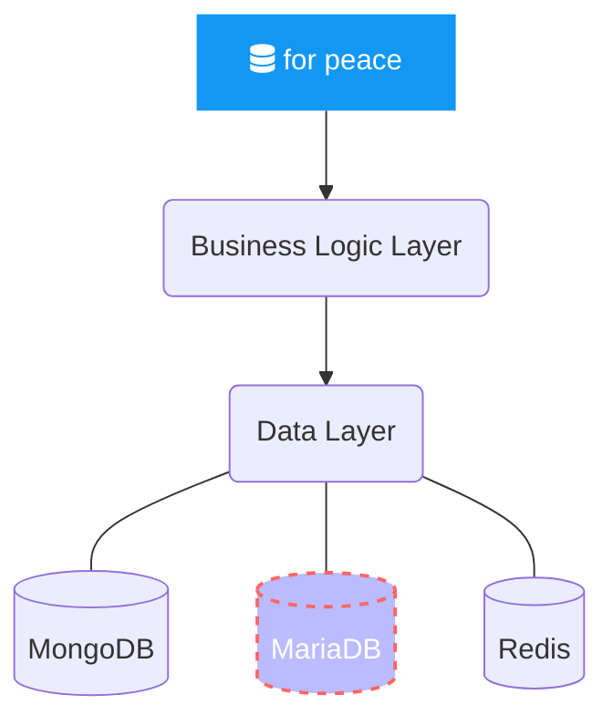

# Haxagonal Template [](www.google.com)

เป็นตัวอย่างของ Structure Project Go Lang Application ที่ใช้ในการเขียน Api ตัว Golang โดยที่ ใช้การ Design แบบ Hexagonal Architecture (Port & Adapter)

## Table of contents

- [Introduction](#introduction)
- [Environment](#environment-support)
- [Libary](#libary)

## Introduction
---
ก่อนที่จะเข้าใจถึง Architecture Design ของ Hexagonal เราควรเข้าใจถึงการออกแบบ ระบบการทำงานของ Application กันเสียก่อนเพื่อให้รู้ว่า ก่อนที่เราจะออกแบบระบบนั้น เราควรแบบส่วนต่างๆ ระบบออกเป็นอย่างไร โดยส่วนมากแล้วจะแบ่งระบบออกเป็น 3 ส่วนคือ



### Data layer

เป็นส่วนที่ใช้ในการ เก็บข้อมูล หรือเป็นส่วนที่ใช้ในการติดต่อกับ Techonogy ที่ใช้ในการก็บข้อมูล หรือจะเรียกว่าส่วนที่ใช้ในการติดต่อ Database ก็ได้ เช่น หากว่าเราจะใช้ MongoDB หรือ Mysql เพื่อที่จะเก็บข้อมูลของ Application จะมีเพียง Data Layer เท่านั้นที่จะเชื่อมต่อ หรือ รู้ถึงการมีอยู่ของ Database ที่กำลัง Connect อยู่ใน Application

### Business Logic Layer

เป็นส่วนหลักของการทำงานของระบบ โดยการทำงานในส่วนนี้จะยึดโยงกับ Requirement ของ Application เป็นเป็นส่วนที่ใช้ในการ Process งานต่างๆ เช่น เมื่อมีมีการเพื่ม User เข้ามาในระบบ ส่วนของ Business Logic Layer จะต้องทำการ Process ว่า ข้อมูลของ User มีความถูกต้อง มีความครบถ้วน เกิดข้อผิดผลาดอะไรหรือไม่ หรือ เกิดปัญหาใดๆ อย่างเช่น มี User นั้นอยู่ในระบบอยู่แล้ว การ Handler Error ต่างๆ การทำ Logger จะอยู่ใน Layer นี้ทั้งหมด หากว่า ข้อมูลมีความถูกต้องครบถ้วน ตาม Requirement ก็จะทำการส่ง ข้อมูลไปยัง Data Layer เพื่อบันทึกต่อไป

### Presentation Layer

เป็นส่วนที่ใช้ในการติดต่อกับผู้ใช้งานโดยการใช้งานนั้นแบบได้ออกเป็นหลายรูปแบบขึ้นอยู่กับ Technology เช่น RESTfull ,Websocket, MessageQuery หรือ Cli โดยหน้าที่หลักๆ ของ layer นี้จะเป็นช่องทางที่ให้ User ใช้งานระบบได้ เช่น หากต้องการ API(Application Programing Interface) ที่ใช้ในการ เพิ่ม User ในระบบ ตัว Presentation Layer ก็จะใช้ libary หรือ Framework ที่สามาร ทำ API Server ได้ เช่น net/http,fiber หรือ echo เพื่อรองรับช่องทางที่จะรับคำสั่งและข้อมูลจาก User และเมื่อได้รับคำสั่งและข้อมูลเรียบร้อยแล้วก็จะส่งไปยัง Business Logic Layer ว่าสามารถทำตามที่ User ร้องขอได้หรือไม่

## Features

## Environment Support

| Name     | Require | Detali            |
| -------- | :-----: | ----------------- |
| database |  true   | MongoDB , MaraiDB |
| cache    |  true   | Redis             |
| logs     |  true   | zap , logi        |
| storage  |  false  | local , s3        |

---

#### Libary

- [fiber](github.com/gofiber/fiber/v2)
- [redis](github.com/go-redis/redis/v9)
- [mongo-driver](go.mongodb.org/mongo-driver)
- [zap log](go.uber.org/zap)
- [viper](github.com/spf13/viper)

---

### Structure Project

```
project
│
└─── core
│    └─── models
│    │    └─── pod.go
│    │    └─── adapter.go
│    │
│    └─── repositories
│    │    └─── pod.go
│    │    └─── adapter.go
│    │
│    └─── services
│    │    └─── pod.go
│    │    └─── adapter.go
│
└─── common
│    └─── cache
│    │    └─── pod.go
│    │    └─── adapter.go
│    │
│    └─── logs
│    │    └─── pod.go
│    │    └─── adapter.go
│    │
│    └─── storage
│    │    └─── pod.go
│    │    └─── adapter.go
│
└─── handler
│    └─── handler.go
│
└─── middlewares
│    └─── moddleware.go
│
└─── docs
│     └─── docs.go
│     └─── swagger.json
│     └─── swagger.yaml
│
└─── README.md
└─── main.go
└─── go.mod


```


