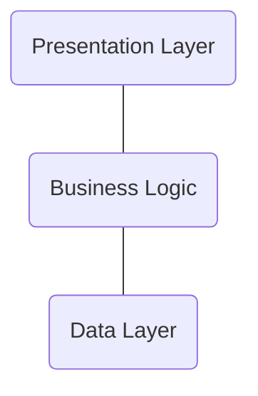

# Haxagonal Template [](www.google.com)

เป็นตัวอย่างของ Structure Project Go Lang Application ที่ใช้ในการเขียน Api ตัว Golang โดยที่ ใช้การ Design แบบ Hexagonal Architecture (Port & Adapter)

## Table of contents

- [Introduction](#features)
- [Environment](#environment-support)
- [Libary](#libary)

## Introduction
ก่อนที่จะเข้าใจถึง Architecture Design ของ Hexagonal เราควรที่จะเข้าใจถึงการออกแบบของระบบการทำงานของ Application กันเสียก่อนเพื่อให้รู้ว่าก่อนที่เราจะออกแบบระบบนั้นเราควรแบบระบบออกเป็นอย่างไร โดยส่วนมากเเล้วจะเเบ่งระบบออกเป็น 3 ส่วนคือ



## Features

## Environment Support

| Name     | Require | Detali            |
| -------- | :-----: | ----------------- |
| database |  true   | MongoDB , MaraiDB |
| cache    |  true   | Redis             |
| logs     |  true   | zap , logi        |
| storage  |  false  | local , s3        |

---

#### Libary

- [fiber](github.com/gofiber/fiber/v2)
- [redis](github.com/go-redis/redis/v9)
- [mongo-driver](go.mongodb.org/mongo-driver)
- [zap log](go.uber.org/zap)
- [viper](github.com/spf13/viper)

---

### Structure Project

```
project
│
└─── core
│    └─── models
│    │    └─── pod.go
│    │    └─── adapter.go
│    │
│    └─── repositories
│    │    └─── pod.go
│    │    └─── adapter.go
│    │
│    └─── services
│    │    └─── pod.go
│    │    └─── adapter.go
│
└─── common
│    └─── cache
│    │    └─── pod.go
│    │    └─── adapter.go
│    │
│    └─── logs
│    │    └─── pod.go
│    │    └─── adapter.go
│    │
│    └─── storage
│    │    └─── pod.go
│    │    └─── adapter.go
│
└─── handler
│    └─── handler.go
│
└─── middlewares
│    └─── moddleware.go
│
└─── docs
│     └─── docs.go
│     └─── swagger.json
│     └─── swagger.yaml
│
└─── README.md
└─── main.go
└─── go.mod


```


